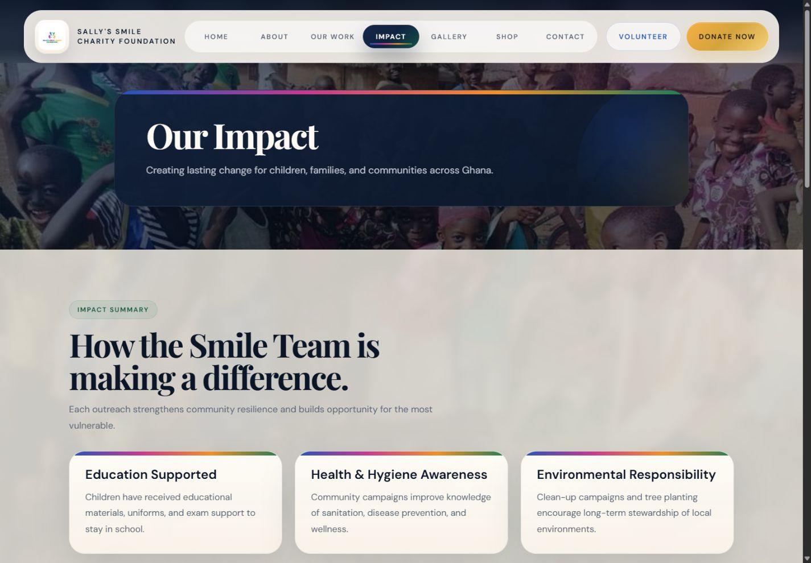
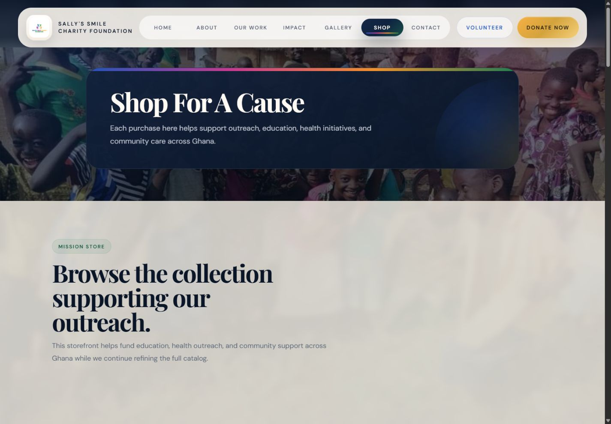

# Sally's Smile Charity Foundation

A responsive charity and social-impact website for Sally's Smile Charity Foundation. The platform presents the foundation's work, impact stories, gallery, donation options, and fundraising shop, with secure serverless payment flows for Paystack and Supabase-backed order records.

## Highlights

- Multi-page responsive website for the foundation's mission, work, and impact
- Gallery and campaign storytelling with optimized local media
- Product catalogue, shopping cart, checkout, and delivery configuration
- One-time donation flow through Paystack hosted checkout
- Netlify Functions for checkout, payment callbacks, status checks, and webhooks
- Supabase-backed payment and order storage
- Verified Paystack webhook signatures
- Optional Resend notifications for administrators
- Payment success and cancellation experiences

## Tech Stack

- HTML5 and CSS3
- Vanilla JavaScript
- Node.js
- Netlify Functions
- Paystack
- Supabase/PostgreSQL
- Resend (optional)

## Screenshots

### Homepage


### Impact



### Fundraising shop



## Project Structure

```text
api/                  Shared payment and data-access modules
assets/               Website styles, scripts, images, gallery, and shop media
data/                 Product catalogue and delivery configuration
docs/                 Payment setup documentation
netlify/functions/    Netlify serverless endpoints
scripts/              Production build scripts
supabase/             Database schema
*.html                Public website pages
netlify.toml           Netlify build and function configuration
```

## Run Locally

Install dependencies:

```bash
npm install
```

Build the Netlify-ready site:

```bash
npm run build
```

For a frontend-only preview, serve the project directory with any static server. For example:

```bash
python -m http.server 8000
```

Then open `http://127.0.0.1:8000`.

To test serverless functions locally, install the Netlify CLI and run:

```bash
npx netlify dev
```

## Environment Variables

Copy `.env.example` to a local `.env` file and configure the required values. Never commit real credentials.

| Variable | Purpose |
| --- | --- |
| `PAYSTACK_SECRET_KEY` | Initializes and verifies Paystack transactions |
| `SITE_BASE_URL` | Public base URL used for callbacks |
| `SUPABASE_URL` | Supabase project endpoint |
| `SUPABASE_SECRET_KEY` | Server-side Supabase credential |
| `SUPABASE_SERVICE_ROLE_KEY` | Legacy fallback for the server credential |
| `ADMIN_ORDER_EMAIL` | Receives order and donation notifications |
| `RESEND_API_KEY` | Optional Resend API credential |
| `ADMIN_FROM_EMAIL` | Optional verified sender address |

See [`docs/payments-setup.md`](docs/payments-setup.md) for the complete payment setup.

## Database Setup

Run [`supabase/schema.sql`](supabase/schema.sql) in the Supabase SQL editor. It creates the payment and payment-item tables, indexes, and automatic update timestamp trigger.

## Deployment

The repository is configured for Netlify:

- Build command: `npm run build`
- Publish directory: `dist`
- Functions directory: `netlify/functions`

Configure all production secrets in the Netlify environment settings and register the Paystack webhook at:

```text
https://your-domain/.netlify/functions/payment-webhook
```

## Security Notes

- Payment secrets and Supabase server credentials are read only from environment variables.
- Paystack webhook signatures are verified before processing events.
- Local `.env` files, deployment state, generated builds, private business documents, and development tooling are excluded from Git.
- The repository contains no production API keys or customer payment records.

## Status

The website and Netlify production build are functional. Live payments require valid Paystack and Supabase configuration, verified callback URLs, and final review of products and delivery fees.
